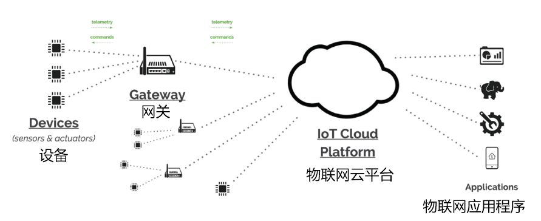
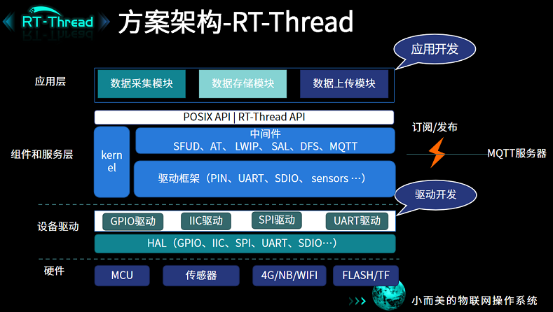

# modbus2mqtt_gateway 应用案例 demo

## 简介

网关又称为协议转换器，网关的功能是实现不同网络之间的相互连接。网关不仅可以让广域网之间相互连接，也可以让局域网之间相互连接。网关在计算机和设备之间起转换的作用，相当于一个翻译器，可以使不同的协议、语言、数据在不同的系统之间进行转换。

## 教程说明

此案例是基于 ART-Pi 实现的 modbus2mqtt 网关应用demo。   
需要用到的硬件设备有： ART-Pi 开发板、usb-ttl 工具；   
PC 工具有：MQTTBox、ModbusSlave、FileZilla、qboot打包器、串口终端工具如 Putty、Xshell等。

- 需求分析
    - 使用 modbus 协议向终端设备、传感器采集数据
    - 网络连接：WiFi、cat1、以太网...
    - 接入云平台：MQTT 协议对接云平台并上传数据
    - 数据记录存储
    - OTA 升级固件

- 方案架构
    

- 例程说明
    - [led_red.c](./sample/led_red.c)：学习 GPIO 的控制与使用

    - [uart_sample.c](./sample/uart_sample.c) ：学习串口设备的使用方式

    - [sample_mb_master.c](./sample/sample_mb_master.c)：学习基于 freemodbus 软件包的 modbus-master 使用方式

    - [modbus2mqtt.c](./sample/modbus2mqtt.c)：学习 modbus2mqtt 网关的架构设计和实现逻辑。

- [案例操作手册](./doc/Modbus2MQTT网关-操作手册.pdf)：存放在[ /doc/Modbus2MQTT网关-操作手册.pdf]
