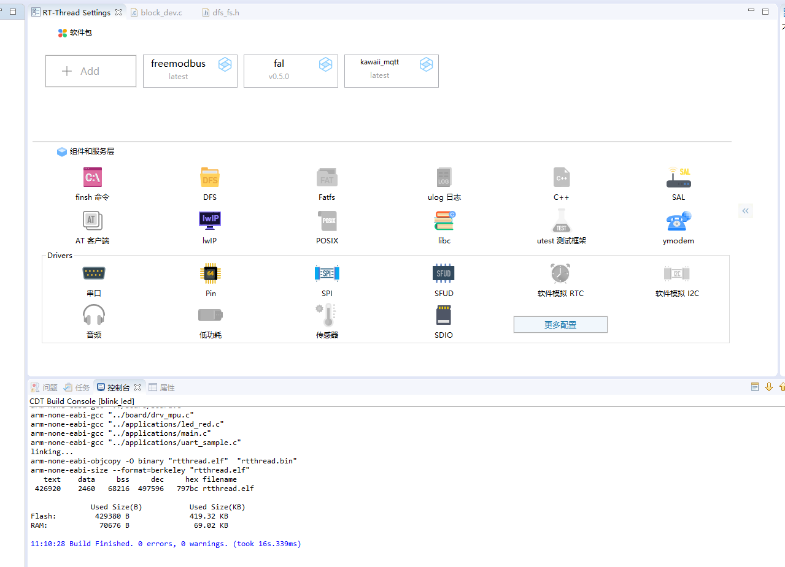
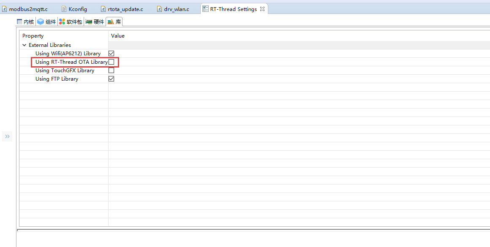

# Modbus2MQTT 网卡裁剪优化

首先，把拿到的 LED 这个工程先进行编译；查看 ROM 与 RAM 的大小，作为一个起始工程，并不附带更多的功能。

我们的裁剪教程，也将从这一步开始，慢慢的增加内容，并有的放矢得介绍添加的组件或者软件包的功能及其注意事项。

## 一、准备

### 0. 准备工作

启用 RT-Studio 这个工具来编辑工程，有一个比较舒适的功能。你可以看到工程中参与编译的文件和未参与编译的文件。这个功能可以在这个位置来配置：


通过调整这里的配置，就可以实现显示没有（此时是灰色的）参与编译的工程的效果；


通过这个效果，一些文件的参与与排除就能很简单的查看而且对整个工程做到心中有数。

### 1. 创建一个 LED 的原始工程

这个原始工程，理论上应该不包括多余的部分；可仅仅是一个 LED 工程，貌似并没有启用更复杂的功能，讲道理不应该占用如此高的空间。


我们观察左侧的工程参与编译的文件，就发现添加了一些诸如文件系统，POSIX标准之类的功能，我们没有启用；讲道理，这一块是不需要的，可是却仍然被默认添加到工程中。实际上，这是由于工程里的残留配置导致的。


取消掉无用的配置，并且编译，可以看到当前工程下的大小。


通过编译信息，我们还能查看到内存占用确实降低了；不过，此时我们还没有添加功能；

OK，接下来，我们一步步按照会议的 PPT 添加所需要的软件包和库，看看编译结果。

### 2. 添加 led_sample 与 uart_sample 文件

添加示例文件，使能 UART1 串口。


### 3. 添加 Modbus 软件包

添加 freemodbus 软件包，使能对应的 sample 文件并且编译。


### 4. 添加 WIFI 功能的支持

添加 WIFI 功能，记得需要打开 DFS，LIBC ，也就是我们准备阶段关闭的那个。


### 5. 添加 MQTT 的支持

添加 Kawaii-mqtt 软件包，修改保活时间，使能 sample 文件参与编译。



### 6. 添加 SPI Flash 文件系统

添加 SPI Flash 后，自动加入了 littlefs 文件系统。


### 7. 添加 FTP 文件传输功能

添加 FTP 的库文件，并且添加 modbus2mqtt.c 文件。


## 二、裁剪

经历过上面的 7 个步骤，就已经把我们本次实验的初始环境搭建好了。我们的目的，就是尽可能得降低工程代码的大小，降低使用到的芯片资源。

裁剪前，我们先明确要求：

1. 不影响 MQTT 功能。
2. 不影响 modbus 功能。
3. 不影响 FTP 功能。
4. 不影响文件存储功能。

这四项要求的意义就在：

1. 网络功能正常，意味着保证 lwip ，wifi，SDIO 功能正常，因为板载的这块 AP6212 是使用 SDIO 接口来通讯的；而我们使用的 WIFI 功能，则需要我们保留 WIFI 框架的功能；使用 lwip 方式呢，又会启用 SAL 接口；由于一些 C 库的支持，我们也需要打开 Libc 的支持。
2. 文件系统功能正常，意味着 SPI，SFUD 这种片上 Flash 的管理驱动正常；同时启用 DFS 的接口，与 POSIX 接口。
3. modbus2mqtt.c 文件一定要参与到工程的编译中。


所以，不牵扯到这部分的功能就可以删去了。例如：Finish 组件与 ymodem 组件；添加的软件包自带的各种 sample 文件；

### 1. 去掉无用的 sample 文件

```application/uart_sample.c``` 与 ```application/led_red.c ```文件可以使用 IDE 的单个文件排除的方式来避免编译。

在一个文件上点开这个配置项，选中 “Debug” 选项就可以实现把文件排除在构建目录中。


另外通过 RT-Setting 取消掉 kawaii-mqtt 与 freemodbus 软件包中的 sample 文件。


经过配置，代码的编译结果为：


### 2. 去掉 lwip 中没有用到的功能

关闭 IGMP 网络组播功能，关闭 ICMP 功能，由于 ICMP 功能被 PING 功能（lwip 配置项的下面部分）引用，所以要先取消 PING 功能才能关掉 ICMP 的功能。


### 3. 优化 lwip 的配置

可以裁剪掉一部分的占用，来降低 RAM 的占用；lwip 的配置项主要集中在 lwipopt.h 与 lwip/opt.h 中。除了一些可以在 RT-Setting 中配置的，还有可以在头文件中直接修改。


### 4. 去掉 ymodem 组件

ymodem 组件，可以理解为是一个串口上的传输协议，ymodem 可以实现一些升级的服务；在我们的工程中，ymodem 功能其实并没有启用，我们完全可以去掉这个功能。但是在使用 RT-Setting 配置时，这个选项并不能直接关闭。原因是由于我们的 wifi 的一部分功能关联到了一部分的升级工作，而升级工作又关联到了 ymodem 功能。所以，我们需要修改 [Kconfig 文件](https://www.rt-thread.org/document/site/#/development-tools/kconfig/kconfig)与 [Sconscript 文件](https://www.rt-thread.org/document/site/#/development-tools/scons/scons)来避免 ymodem 功能参与编译。


Kconfig 文件是一个 python 脚本，可以使用 ```#```来注释掉 ymodem 的使用；修改完后，关闭 RT-Setting 后重新点开， 以让 RT-Setting 解析修改后的 Kconfig 脚本，然后记得关闭 RT_OTA_LIB 对的功能。

```Attention: 修改 Kconfig 后，应当关闭 RT-Setting 界面后重新打开并继续配置，否则配置选项会出现逻辑错误。```




这个时候，点击编译工程，工程是会报错的。因为 ```rt_ota.h``` 的功能已经被我们删去了，工程链接时会出现问题。但是，功能又确实没有用到，所以需要修改```drv_wlan.c```下的代码，以避免出现编译错误。

```c
//#include <rt_ota.h>

int wiced_platform_resource_size(int resource)
{
    int size = 0;

    /* Download firmware */
    if (resource == 0)
    {
//        size = rt_ota_get_raw_fw_size(partition);
    }
    else if (resource == 1)
    {
        size = sizeof(wifi_nvram_image);
    }

    return size;
}

static void wifi_init_thread_entry(void *parameter)
{
    /* initialize fal */
    fal_init();
//    partition = fal_partition_find(WIFI_IMAGE_PARTITION_NAME);
//
//    if (partition == RT_NULL)
//    {
//        LOG_E("%s partition is not exist, please check your configuration!", WIFI_IMAGE_PARTITION_NAME);
//        return;
//    }
//
//    { /* upgrade the wifi_image */
//        int result = 0;
//        /* verify OTA download partition */
//        if (rt_ota_init() >= 0 && rt_ota_part_fw_verify(fal_partition_find(RT_OTA_DL_PART_NAME)) >= 0)
//        {
//            /* do upgrade when check upgrade OK */
//            if (rt_ota_check_upgrade() && (result = rt_ota_upgrade()) < 0)
//            {
//                log_e("OTA upgrade failed!");
//                //TODO upgrade to safe image?
//            }
//            /* when upgrade success, erase download partition firmware.
//             * The purpose is to prevent other programs from using.
//             */
//            if (result >= 0)
//            {
//                fal_partition_erase(fal_partition_find(RT_OTA_DL_PART_NAME), 0, 4096);
//            }
//
//        }
//    }
//
//    if (rt_ota_part_fw_verify(partition) >= 0)
//    {
        /* initialize low level wifi(ap6212) library */
        wifi_hw_init();

        /* waiting for sdio bus stability */
        rt_thread_delay(WIFI_INIT_WAIT_TIME);

        /* set wifi work mode */
        rt_wlan_set_mode(RT_WLAN_DEVICE_STA_NAME, RT_WLAN_STATION);
        /* NEED TODO !!! */
        /* rt_wlan_set_mode(RT_WLAN_DEVICE_AP_NAME, RT_WLAN_AP); */

        init_flag = 1;
//    }
//    else
//    {
//        LOG_E("Wi-Fi image was NOT found on %s partition!", WIFI_IMAGE_PARTITION_NAME);
//    }
}
```

通过上述 办法的调整，我们可以将工程简化到这个程度。


### 5. 启用 Nano 的 Libc 库

这个属于编译器的优化选项，启用更小的 C 库以降低编译内存的占用。


### 6. 启用 -Os 编译选项，进一步压缩固件大小


### 7. 裁剪掉 Finish 组件

Finish 组件，是我们 RT-Thread 系统的一个用于命令行的工具。可以实现通过命令行来调用某些函数，对于调试非常方便。但是对于一个释出的成品，finish 就不是那么重要了，所以我们裁撤掉。对于我们前面的使用用例，裁撤掉 finish 意味着不能使用命令行启动线程。所以，我们需要修改```modbus2mqtt.c```下的代码，以支持该线程的自动启动。我们在代码中添加 ```INIT_APP_EXPORT(modbus2mqtt)```代码，以支持线程自启动，避免使用手动输入命令启动代码。


### 8. 去掉调试 LOG 的信息

调试的 LOG 一般都是一段字符信息，这些信息和代码逻辑都会以 Code 或者 Read-only 的形式存放在 Flash 上，现象就是占用了 ROM 空间。

所以，取消掉，kawaii-mqtt 的 LOG 信息，也可以降低一些代码量。


仅通过配置，可以裁剪掉超过 50% 的代码量；对于一项产品来说，内存裁剪是一项细致的工作。通过删去不需要的代码来换取空间的节省，既可以节省 Flash 大小，又可以在产品选型上实现较小内存的芯片资源的适配。

## 三、总结

内存裁剪的工作的主要逻辑是，去掉未使用的功能以实现减少内存使用的需求。RT-Thread 提供了丰富的软件包与组件功能，在开发时可以为我们提供很大的助力，对组件及软件包的熟悉程度越高，越可以指导我们更好的裁剪工程。


By RT-Thead Team

